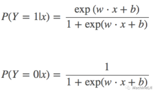
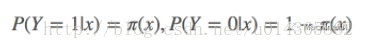
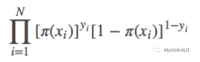
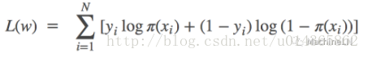
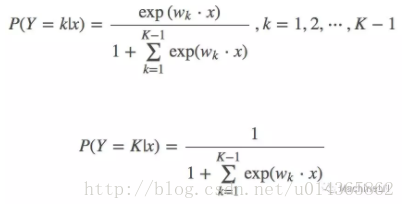
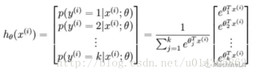

MachineLN之逻辑回归
===
逻辑回归可以这样理解： 和感知机比较着来看或许更好，将感知机的表达式中的sign函数换成sigmoid就是逻辑回归的表达式，但是这一换不要紧，导致后边参数更新的方式完全不同，因为逻辑回顾的损失函数是参数连续可导的，还记得我们说过感知机的损失函数是参数连续不可导的吗？ ：MachineLN之感知机


还是一如既往：

说起逻辑回归，那么我的问题：（根据MachineLN之三要素：模型、策略、算法）


（1）什么是逻辑回归？（模型）

（2）逻辑回归是如何学习的？（策略）

（3）逻辑回归学习算法？（算法）

看到这里你的答案是什么？下面是我的答案：


1. 什么是逻辑回归？

前面有提到，逻辑回归是来解决分类问题的，而不是回归问题，想想问什么呢？就是因为sigmoid。说起sigmoid应该很熟悉吧：MachineLN之激活函数

直接看一下二项逻辑回归表达式吧：可以理解为事件发生的概率和事件不发生的概率：




2. 逻辑回归是如何学习的？

逻辑回归可以通过极大似然估计（什么是极大似然估计，简单说利用已知的样本结果，反推有可能（最大概率）导致这样结果的参数值（模型已知，参数未知））来估计模型参数：

设：




那么似然函数可表示为：




为了后面求导，这里取对数似然函数：

那么对数似然函数，也就是损失函数为：



接下来我们要求其最大值，其最大值的要用梯度上升法，如果想用梯度下降只需要加一个负号，利用梯度下降法求最小值。


（3）逻辑回归学习算法？

下一节的源代码解析你会看到就是按照这个更新公式来做的，但是加了一些优化。

另外可以考虑一下：逻辑回归和softmax回归的关系？ 多项逻辑回归是softmax吗？ 答案是肯定的！

看下面逻辑回归表达式：



在看softmax表达式：




MachineLN之逻辑回归源码
===


逻辑回归的原理，今天看一下带详细注释的源码：切记好代码都是敲出来的，并且越敲越有感觉：

```python
def loadDataSet():
  #定义存放样本和标签的列表
  dataMat = []
  labelMat = []
  fr = open('testSet.txt')
  #读取文件的每一行数据，样本和标签
  for line in fr.readlines():
    #分隔每行数据
    lineArr = line.strip().split()
    #前两个是样本数据，又添加了一个维度，目的是将w和b融合在一起，方便计算
    dataMat.append([1.0,float(lineArr[0]),float(lineArr[1])])
    #样本添加标签
    labelMat.append(int(lineArr[2]))
  return dataMat, labelMat

```


```python
#定义sigmoid函数
def sigmoid(inX):
  return 1.0/(1+exp(-inX))


```


梯度下降

```python
#梯度上升求函数的最大值，梯度下降算法用来求损失函数的最小是，就相差一个负号；

def gradAscent(dataMatIn, classLabels):
  #将样本定义为矩阵，方便参数更新时候矩阵计算；
  dataMatrix = mat(dataMatIn)
  #将标签也转化为矩阵的具体形式，方便后边的 预测值和真实值；
  labelmat = mat(classlabels).transpose()
  #得到矩阵行数与列数，就可以计算样本的维度，维度用来定义权重参数w和b
  m,n = shape(dataMatrix)
  #权重的学习率
  alpha = 0.001
  #选择重新更新多少次
  maxCtcles = 500
  #初始化权重都是数字1；
  weights = ones(n,1)
  #循环更新权重值
  for k in range(maxCycles):
    #根据更新后的权重预测样本的类别值
    h = sigmoid(dataMatrix * weights)
    #真是标签和样本之做差值
    error = （labelMat - h）
    weights = weights + alpha * dataMatrix.transpose()*error
  return weights
```

```python
import matplotlib.pyplot as plt
#下面就是画不同类别的样本点和分类线；

def plotBestFit(weights):
  dataMat,labelMat=loadDataSet()
  dataArr = array(dataMat)
  n = shape(dataArr)[0]
  xcord1 = []
  ycord1 = []
  xcord2 = []
  ycord2 = []
  for i in range(n):
    if int(labelMat[i])== 1;
      xcord1.append(dataArr[i,1])
      ycord1.append(dataArr[i,2])
    else:
      xcord2.append(dataArr[i,1])
      ycord2.append(dataArr[i,2])
  fig = plt.figure()
  ax.scatter(xcord1,ycord1,s=30,c='red',marker='s')
  ax.scatter(xcord2,ycord2,s=30,c='green')
  x = arange(-3.0, 3.0, 0.1)
  y = (-weights[0]-weights[1]*x)/weights[2]
  ax.plot(x,y)
  plt.xlabel('X1')
  plt.ylabel('X2')
  plt.show()

```


```python

#梯度上升每次更新权重都要便利整理数据集合，该方法在少数的数据集合上可以使用，但数据集合较大的时候，计算发杂度比较高
# 下面修改方法一次用一个样本更新权重

def stocGradAscent0(dataMatrix, classLabels):
  #获取样本的行数与列数，标识样本数量和维度；
  m,n = shape(dataMatrix)
  #定义随机梯度上升的学习率
  alpha = 0.01
  #初始化权重
  #weights = ones(n)
  #遍历所有样本，用每一个样本更新权重
  for i in range(m):
    #预测一个样本的类型
    h = sigmoid(sum(datamatrix[i]*weights))
    error = classlabels[i] - h
    #权重更新迭代
    weights = weights + alpha *error*dataMatrix[i]
  return weights


```

```python
#由于上面的随机梯度下降的学习率是确定的,并且样本的顺序也是固定的
#下面对其进行进化，学习率随着迭代次数增加而增加，并且样本引入随机性，就是随机选取样本进行权重更新

def stocGradAscent0(dataMatrix, classLabels, numIter =150):
  m,n = shape(datamatrix)
  weights = ones(n)
  for j in range(numIter):
    dataIndex = range(m)
    for i in range(m):
      #学习率不再是唯一的
      alpha = 4/(1.0+j+i)+0.0001
      #随机选取样本，这种方法可以减少周期性的波动；
      randIndex = int(random.uniform(0,len(dataIndex)))
      h = sigmoid(sum(dataMatrix[randIndex]*weights))
      error = classLabels[randIndex]-h
      weights = weights + alpha*error*dataMatrix[randIndex]
      del(dataIndex[randIndex])
  return weights

```


```python
#下面就是分出类别，根据sigmoid的结果，大于0为1，小于0为0；

def classifyVector(inX, weights):
  prob = sigmoid(sum(inX*weights))
  if prob >0.5 :
    return 1.0
  else:
    return 0.0

```


```python
# 下面进行训练和测试阶段
def colicTest():
  #分别打开训练机和测试集合的文件
  frTrain = open('horseColicTraining.txt')
  frTest = open('horseColicTest.txt')
  #定义保存训练样本和标签的列表
  trainingSet = []
  trainingLabels = []
  #每读取一行，也就是每一个样本的标签
  for line in frTrain.readlines():
    #用样本和标签进行分割
    currLine = line.strip().split('\t')
    #用与保存每一个样本中所有值
    lineArr = []
    for i in range(21):
      lineArr.append(float(currLine[i]))
    trainingSet.append(lineArr)
    trainingLabels.append(float(currLine[21]))
  #用随机数迭代1000次计算权重
  trainWeights = stocGradAscent1(array(trainingSet),trainingLabels,1000)
  #根据上面求得的权重值，测试 在测试结果中的准确率及错误率；
  errorCount = 0
  numTestVec = 0.0
  # 读取测试数据的每一样测试
  for line in frTest.readlines():
    #用统计测试样本数量
    numTestVec += 1.0
    #和上边一样，用分割样本数据和标签数据
    currLine = line.strip().split('\t')
    lineArr = []
    for i in range(21):
      lineArr.append(float(currLine[i]))
    #下面计算预测值和真实值是否相等，如果不相等加以，统计错误比例
    if int(classifyVector(array(lineArr),trainWeights)) != int(currLine[21]):
      errorCount +=1
  errorRate = (float(errorCount)/numTestVec)
  print('the error rate of this test is %f'%errorRate)
  return errorRate


```

```python
#相当于计算十次的权重，取平均值；
def multiTest():
  numTests = 10
  errorSum = 0.0
  for k in range(numTests):
    errorSum += colicTest()
  print('after %d iterations the average error rate is %f'%(numTests,errorSum/numTests))

```
